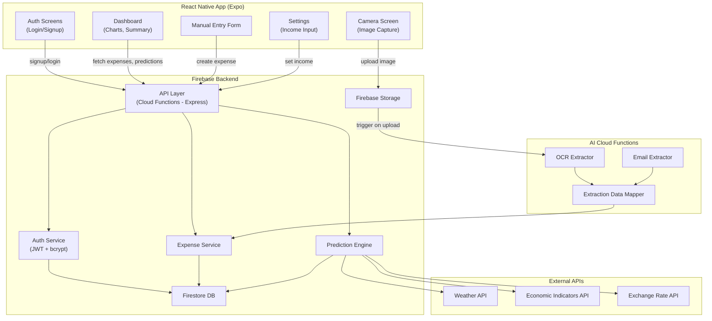
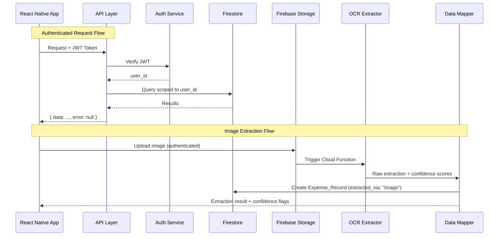
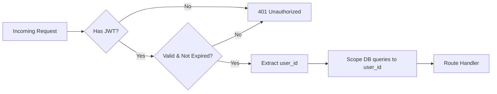

# Design Document: BillBuddy MVP

## Overview

BillBuddy MVP is an AI-powered mobile expense tracking application built with React Native (TypeScript) on the frontend and Firebase (Firestore, Cloud Functions) on the backend. The system enables users to track domestic expenses through three input channels: manual entry, camera-based OCR extraction, and email receipt parsing. It provides a visual dashboard for financial status, predictive analysis using external data sources, and income/expense compatibility alerts.

The architecture follows an event-driven pattern where AI extraction Cloud Functions are triggered by image uploads or email webhooks. All data flows through a JWT-authenticated API layer that enforces strict user-scoped data isolation. The frontend uses Expo Router for navigation, Zustand for state management, and NativeWind for styling.

### Key Design Decisions

1. **Custom JWT + bcrypt auth over Firebase Auth**: Provides full control over token payload (embedding user_id) and password hashing, aligning with the requirement for custom auth logic.
2. **Firestore over Realtime Database**: Better suited for structured queries (filtering expenses by category, date ranges, user_id) and offline support.
3. **Cloud Functions for AI processing**: Keeps AI extraction logic serverless and event-driven, scaling independently from the main API.
4. **Zustand over Context API**: Simpler API for global state with less boilerplate and better performance for frequent dashboard updates.
5. **Standardized API response envelope**: `{ data, error }` pattern simplifies frontend error handling and provides a consistent contract.

## Architecture

### High-Level Architecture



### Request Flow



## Components and Interfaces

### Backend Components

#### Auth Service (`functions/src/services/authService.ts`)
Handles user registration, login, and JWT token management.

```typescript
interface AuthService {
  signup(email: string, password: string): Promise<ApiResponse<{ token: string; user: User }>>;
  login(email: string, password: string): Promise<ApiResponse<{ token: string; user: User }>>;
  verifyToken(token: string): Promise<{ userId: string }>;
}
```

#### Expense Service (`functions/src/services/expenseService.ts`)
CRUD operations for expense records, always scoped to the authenticated user.

```typescript
interface ExpenseService {
  createExpense(userId: string, data: CreateExpenseInput): Promise<ApiResponse<Expense>>;
  getExpenses(userId: string, filters?: ExpenseFilters): Promise<ApiResponse<Expense[]>>;
  updateExpense(userId: string, expenseId: string, data: Partial<Expense>): Promise<ApiResponse<Expense>>;
  deleteExpense(userId: string, expenseId: string): Promise<ApiResponse<void>>;
}

interface CreateExpenseInput {
  category: ExpenseCategory;
  amount: number;
  dueDate: string;
  isPaid: boolean;
  extractedVia: 'email' | 'image' | 'manual';
  rawSourceRef?: string;
}

interface ExpenseFilters {
  category?: ExpenseCategory;
  month?: number;
  year?: number;
  isPaid?: boolean;
}
```

#### OCR Extractor (`functions/src/extractors/ocrExtractor.ts`)
Cloud Function triggered by Firebase Storage uploads. Processes bill/receipt images.

```typescript
interface ExtractionResult {
  amount: { value: number; confidence: number };
  category: { value: ExpenseCategory; confidence: number };
  dueDate: { value: string; confidence: number };
}

interface OCRExtractor {
  processImage(storageUrl: string): Promise<ExtractionResult>;
}
```

#### Email Extractor (`functions/src/extractors/emailExtractor.ts`)
Cloud Function triggered by email webhook. Parses email body and attachments.

```typescript
interface EmailExtractor {
  processEmail(emailPayload: EmailWebhookPayload): Promise<ExtractionResult>;
}

interface EmailWebhookPayload {
  from: string;
  subject: string;
  body: string;
  attachments?: Array<{ filename: string; content: string; mimeType: string }>;
}
```

#### Extraction Data Mapper (`functions/src/extractors/dataMapper.ts`)
Validates and maps raw AI extraction output to the Expense interface.

```typescript
interface DataMapper {
  mapToExpense(raw: ExtractionResult, userId: string, source: 'email' | 'image', sourceRef: string): Expense;
  validateExpenseData(data: Partial<Expense>): ValidationResult;
  serializeExpense(expense: Expense): string;
  deserializeExpense(json: string): Expense;
}

interface ValidationResult {
  valid: boolean;
  errors: string[];
  needsReview: boolean;
}
```

#### Prediction Engine (`functions/src/services/predictionEngine.ts`)
Analyzes historical data with external factors to forecast expenses.

```typescript
interface PredictionResult {
  category: ExpenseCategory;
  predictedMin: number;
  predictedMax: number;
  factors: PredictionContext;
}

interface PredictionEngine {
  generatePredictions(userId: string): Promise<ApiResponse<PredictionResult[]>>;
  hasEnoughData(userId: string): Promise<boolean>;
}
```

#### API Response Envelope (`functions/src/types/api.ts`)

```typescript
interface ApiResponse<T> {
  data: T | null;
  error: string | null;
}

type ExpenseCategory = 'electricity' | 'water' | 'insurance' | 'loan' | 'gas' | 'manual';
```

### Frontend Components

#### Screens
- `app/(auth)/login.tsx` — Login form with email/password
- `app/(auth)/signup.tsx` — Signup form with validation
- `app/(tabs)/index.tsx` — Dashboard (charts, summary, upcoming bills)
- `app/(tabs)/camera.tsx` — Camera capture for bill scanning
- `app/(tabs)/settings.tsx` — Income input, category management

#### Shared Components
- `components/dashboard/ExpensePieChart.tsx` — Category distribution chart
- `components/dashboard/MonthSummary.tsx` — Total paid/unpaid, income ratio
- `components/dashboard/UpcomingBills.tsx` — Sorted unpaid bills list
- `components/dashboard/PredictionCard.tsx` — Predicted expense ranges
- `components/forms/ManualExpenseForm.tsx` — Manual expense entry form
- `components/forms/ExtractionReview.tsx` — Review/correct low-confidence fields
- `components/shared/AlertBanner.tsx` — Income/expense warnings

#### Custom Hooks
- `hooks/useAuth.ts` — Login, signup, token management
- `hooks/useExpenses.ts` — CRUD operations, filtering
- `hooks/useExtraction.ts` — Image upload, extraction status polling
- `hooks/usePrediction.ts` — Fetch predictions
- `hooks/useDashboard.ts` — Aggregated dashboard data

#### State Store (`store/`)
Zustand store slices:
- `authStore.ts` — JWT token, current user
- `expenseStore.ts` — Expense list, filters, loading states
- `incomeStore.ts` — Monthly income setting


### JWT Authentication Middleware



All API endpoints (except `/auth/signup` and `/auth/login`) pass through the JWT middleware. The middleware extracts `user_id` from the token payload and attaches it to the request context, ensuring every downstream database operation is scoped to the authenticated user.

## Data Models

### Firestore Collections

#### `users` Collection

| Field | Type | Description |
|-------|------|-------------|
| `id` | `string` (UUID) | Primary key, auto-generated |
| `email` | `string` | Unique, validated email address |
| `password_hash` | `string` | bcrypt-hashed password (never plaintext) |
| `monthly_income` | `number \| null` | User-set monthly income in THB |
| `created_at` | `Timestamp` | Account creation timestamp |

#### `expenses` Collection

| Field | Type | Description |
|-------|------|-------------|
| `id` | `string` (UUID) | Primary key, auto-generated |
| `user_id` | `string` (UUID) | Foreign key to users collection |
| `category` | `ExpenseCategory` | One of: electricity, water, insurance, loan, gas, manual |
| `amount` | `number` | Positive number in THB |
| `currency` | `string` | Always "THB" for MVP |
| `due_date` | `Timestamp` | Bill due date |
| `is_paid` | `boolean` | Payment status |
| `extracted_via` | `string` | One of: email, image, manual |
| `raw_source_ref` | `string \| null` | Firebase Storage URL or email ID |
| `needs_review` | `boolean` | True if any AI field had confidence < 0.5 |
| `created_at` | `Timestamp` | Record creation timestamp |

### Firestore Indexes

- `expenses`: Composite index on `(user_id, due_date)` for upcoming bills query
- `expenses`: Composite index on `(user_id, category, created_at)` for category filtering
- `expenses`: Composite index on `(user_id, is_paid, due_date)` for paid/unpaid filtering

### Data Validation Rules

1. `email`: Must match RFC 5322 email format
2. `password`: Minimum 8 characters (validated before hashing)
3. `amount`: Must be a positive number (`amount > 0`)
4. `category`: Must be one of the allowed `ExpenseCategory` values
5. `due_date`: Must be a valid ISO 8601 date string
6. `extracted_via`: Must be one of `'email' | 'image' | 'manual'`
7. `currency`: Must be `'THB'` (enforced server-side for MVP)

### TypeScript Type Definitions

```typescript
// types/expense.ts
export type ExpenseCategory = 'electricity' | 'water' | 'insurance' | 'loan' | 'gas' | 'manual';
export type ExtractionSource = 'email' | 'image' | 'manual';

export interface Expense {
  id: string;
  userId: string;
  category: ExpenseCategory;
  amount: number;
  currency: 'THB';
  dueDate: string;
  isPaid: boolean;
  extractedVia: ExtractionSource;
  rawSourceRef?: string;
  needsReview?: boolean;
  createdAt: string;
}

// types/user.ts
export interface User {
  id: string;
  email: string;
  createdAt: string;
}

// types/prediction.ts
export interface PredictionContext {
  weatherImpact: string;
  economicFactor: number;
  exchangeRate?: number;
}

export interface PredictionResult {
  category: ExpenseCategory;
  predictedMin: number;
  predictedMax: number;
  factors: PredictionContext;
}

// types/api.ts
export interface ApiResponse<T> {
  data: T | null;
  error: string | null;
}

export interface ExtractionFieldResult<T> {
  value: T;
  confidence: number;
}

export interface ExtractionResult {
  amount: ExtractionFieldResult<number>;
  category: ExtractionFieldResult<ExpenseCategory>;
  dueDate: ExtractionFieldResult<string>;
}
```


## Correctness Properties

*A property is a characteristic or behavior that should hold true across all valid executions of a system — essentially, a formal statement about what the system should do. Properties serve as the bridge between human-readable specifications and machine-verifiable correctness guarantees.*

### Property 1: Signup produces bcrypt hash, never plaintext

*For any* valid email and password (≥8 characters), after signup the stored `password_hash` in Firestore SHALL be a valid bcrypt hash and SHALL NOT equal the plaintext password.

**Validates: Requirements 1.1, 1.5**

### Property 2: Short passwords are rejected

*For any* password string with length less than 8 characters, the Auth_Service SHALL reject the signup request with a validation error.

**Validates: Requirements 1.3**

### Property 3: Invalid emails are rejected

*For any* string that does not conform to a valid email format, the Auth_Service SHALL reject the signup request with a validation error.

**Validates: Requirements 1.4**

### Property 4: Duplicate email signup is rejected

*For any* email that already exists in the users collection, a subsequent signup attempt with that email SHALL be rejected with an "email already registered" error.

**Validates: Requirements 1.2**

### Property 5: Signup-then-login round trip

*For any* valid email and password, after a successful signup, logging in with the same email and password SHALL succeed and return a JWT token containing the correct `user_id`.

**Validates: Requirements 2.1, 2.4**

### Property 6: Login with invalid credentials fails

*For any* login attempt where the email does not exist or the password does not match the stored hash, the Auth_Service SHALL reject the request with an "invalid credentials" error (without distinguishing which field is wrong).

**Validates: Requirements 2.2, 2.3**

### Property 7: Invalid or missing JWT returns 401

*For any* API request (to a protected endpoint) that contains an expired JWT, a malformed JWT, or no JWT at all, the Backend SHALL respond with HTTP 401 Unauthorized.

**Validates: Requirements 3.1, 3.2, 3.3**

### Property 8: Data isolation between users

*For any* two distinct users A and B, user A SHALL only see their own expense records and SHALL never be able to read, update, or delete expense records belonging to user B. Attempts to access another user's data SHALL return HTTP 403.

**Validates: Requirements 3.4, 12.1, 12.2**

### Property 9: Extracted_via matches source channel

*For any* expense created through manual entry, the `extracted_via` field SHALL be `"manual"`. *For any* expense created through image extraction, the `extracted_via` field SHALL be `"image"` and `raw_source_ref` SHALL be set. *For any* expense created through email extraction, the `extracted_via` field SHALL be `"email"` and `raw_source_ref` SHALL be set.

**Validates: Requirements 4.1, 5.5, 6.4**

### Property 10: Non-positive amounts are rejected

*For any* expense creation request where the amount is zero or negative, the Expense_Service SHALL reject the request with an "amount must be positive" error.

**Validates: Requirements 4.3**

### Property 11: Currency is always THB

*For any* expense record created in the system (regardless of extraction source), the `currency` field SHALL be `"THB"`.

**Validates: Requirements 4.4**

### Property 12: Extraction confidence scores are bounded

*For any* extraction result from either the OCR_Extractor or Email_Extractor, every confidence score SHALL be a number in the range [0.0, 1.0].

**Validates: Requirements 5.3, 6.2**

### Property 13: Low confidence fields are flagged for review

*For any* extraction result where at least one field has a confidence score below 0.5, the resulting expense record SHALL have `needsReview` set to `true`.

**Validates: Requirements 5.4, 6.3**

### Property 14: Data mapper produces valid Expense records

*For any* raw extraction output, the data mapper SHALL produce an Expense record with a positive `amount`, a `category` that is one of the allowed ExpenseCategory values, and a `dueDate` that is a valid date string.

**Validates: Requirements 7.1, 7.2, 8.1**

### Property 15: Unrecognized categories default to "manual" with review flag

*For any* extraction result where the category string does not match any of the allowed ExpenseCategory values, the data mapper SHALL assign `category = "manual"` and set `needsReview = true`.

**Validates: Requirements 7.3, 8.3**

### Property 16: Expense serialization round trip

*For any* valid Expense object, serializing it to JSON and then deserializing the JSON back SHALL produce an object equivalent to the original.

**Validates: Requirements 7.4, 7.5**

### Property 17: Unpaid bills are sorted by due date ascending

*For any* set of expense records, filtering to unpaid bills and sorting by `due_date` SHALL produce a list where each item's `due_date` is less than or equal to the next item's `due_date`.

**Validates: Requirements 9.3**

### Property 18: Paid plus unpaid equals monthly total

*For any* set of expense records in a given month, the sum of paid expense amounts plus the sum of unpaid expense amounts SHALL equal the total expense amount for that month.

**Validates: Requirements 9.1, 9.4**

### Property 19: Category distribution sums to total

*For any* set of expense records in a given month, the sum of amounts across all category groups SHALL equal the total expense amount for that month.

**Validates: Requirements 9.2**

### Property 20: Prediction range invariant

*For any* prediction result returned by the Prediction_Engine, `predictedMin` SHALL be less than or equal to `predictedMax`, and both SHALL be non-negative numbers.

**Validates: Requirements 10.5**

### Property 21: Insufficient data returns no predictions

*For any* user with fewer than 1 month of historical expense data, the Prediction_Engine SHALL return an insufficient data indicator instead of prediction results.

**Validates: Requirements 10.6**

### Property 22: External factor degradation

*For any* prediction request where one or more external data sources (weather, economic, exchange rate) are unavailable, the Prediction_Engine SHALL still return predictions and SHALL indicate which factors were excluded.

**Validates: Requirements 10.7**

### Property 23: External factors influence respective categories

*For any* user with sufficient historical data, when weather data is provided, utility category predictions (electricity, water, gas) SHALL differ from predictions without weather data. When economic indicators are provided, insurance and loan predictions SHALL differ. When exchange rate data is provided, applicable predictions SHALL differ.

**Validates: Requirements 10.2, 10.3, 10.4**

### Property 24: Income-to-expense alert thresholds

*For any* user with a set monthly income, when total expenses exceed 90% of income the system SHALL produce a warning alert, and when total expenses exceed 100% of income the system SHALL produce a critical alert. When expenses are at or below 90%, no alert SHALL be produced.

**Validates: Requirements 11.2, 11.3, 11.4, 11.5**

### Property 25: API response envelope conformance

*For any* API response from the Backend, the response body SHALL conform to `{ data, error }` where on success `data` is non-null and `error` is null, and on failure `data` is null and `error` is a non-empty string.

**Validates: Requirements 13.1, 13.2, 13.3**

### Property 26: HTTP status codes match error types

*For any* API response, the HTTP status code SHALL be 200 for successful requests, 400 for validation errors, 401 for authentication errors, 403 for authorization errors, and 500 for internal server errors.

**Validates: Requirements 13.4**


## Error Handling

### Error Categories and HTTP Status Codes

| Error Type | HTTP Status | `error` Field Example | When |
|---|---|---|---|
| Validation Error | 400 | `"amount must be positive"` | Invalid input data |
| Authentication Error | 401 | `"invalid credentials"` | Bad/missing/expired JWT, wrong password |
| Authorization Error | 403 | `"access denied"` | User accessing another user's data |
| Not Found | 404 | `"expense not found"` | Resource doesn't exist for this user |
| Server Error | 500 | `"internal server error"` | Unexpected failures |

### Auth Service Error Handling

- Invalid email format → 400 with `"invalid email"`
- Password too short → 400 with `"password too short"`
- Duplicate email → 400 with `"email already registered"`
- Wrong password or nonexistent email → 401 with `"invalid credentials"` (same message for both to prevent user enumeration)
- JWT expired/invalid/missing → 401 with `"unauthorized"`

### Expense Service Error Handling

- Non-positive amount → 400 with `"amount must be positive"`
- Invalid category → 400 with `"invalid category"`
- Invalid date → 400 with `"invalid due date"`
- Expense not found or belongs to another user → 403 with `"access denied"`

### AI Extraction Error Handling

- Unreadable image → Return `ApiResponse` with error `"image is unreadable or too low quality"`
- Unparseable email → Return `ApiResponse` with error `"email format is unsupported"`
- Low confidence fields → Set `needsReview = true` on the expense record; the frontend highlights flagged fields
- Unrecognized category → Default to `"manual"` category, set `needsReview = true`
- AI service timeout → Return 500 with `"extraction service unavailable"`

### Prediction Engine Error Handling

- Insufficient historical data (< 1 month) → Return `ApiResponse` with data containing an `insufficientData: true` flag and a user-facing message
- External API failure (weather/economic/exchange) → Continue with available data, include `excludedFactors` array in the response indicating which sources were unavailable
- All external APIs fail → Generate predictions from historical data only, indicate all external factors excluded

### Frontend Error Handling Strategy

- All API calls go through a centralized `api.ts` module that parses the `{ data, error }` envelope
- On `error !== null`, display the error message via a toast/snackbar notification
- On 401 responses, redirect to the login screen and clear the auth store
- On network errors, display an offline indicator and retry with exponential backoff
- Extraction review screens show inline validation errors for low-confidence fields

## Testing Strategy

### Testing Framework and Libraries

- **Unit & Integration Tests**: Jest (with `ts-jest` for TypeScript)
- **Property-Based Testing**: `fast-check` (JavaScript/TypeScript PBT library)
- **React Native Component Tests**: React Native Testing Library
- **API Testing**: Supertest (for Express-based Cloud Functions)

### Property-Based Testing Configuration

Each property-based test MUST:
- Use `fast-check` with a minimum of 100 iterations (`numRuns: 100`)
- Reference the design document property it validates via a comment tag
- Tag format: `// Feature: billbuddy-mvp, Property {number}: {property_title}`

### Test Organization

```
functions/
├── src/
│   └── ...
└── tests/
    ├── unit/
    │   ├── authService.test.ts          # Properties 1-6
    │   ├── expenseService.test.ts       # Properties 9-11
    │   ├── dataMapper.test.ts           # Properties 14-16
    │   ├── predictionEngine.test.ts     # Properties 20-23
    │   └── apiResponse.test.ts          # Properties 25-26
    ├── property/
    │   ├── auth.property.test.ts        # PBT for Properties 1-6
    │   ├── expense.property.test.ts     # PBT for Properties 9-13
    │   ├── dataMapper.property.test.ts  # PBT for Properties 14-16
    │   ├── dashboard.property.test.ts   # PBT for Properties 17-19
    │   ├── prediction.property.test.ts  # PBT for Properties 20-24
    │   └── api.property.test.ts         # PBT for Properties 25-26
    └── integration/
        ├── authFlow.test.ts             # Signup → Login → Token verification
        ├── expenseFlow.test.ts          # Create → Read → Update → Delete
        ├── extractionFlow.test.ts       # Upload → Extract → Map → Store
        └── dataIsolation.test.ts        # Property 8: Cross-user access prevention

billbuddy/
└── __tests__/
    ├── components/
    │   ├── ManualExpenseForm.test.tsx
    │   ├── ExtractionReview.test.tsx
    │   └── Dashboard.test.tsx
    └── hooks/
        ├── useAuth.test.ts
        └── useExpenses.test.ts
```

### Unit Test Coverage Targets

Unit tests focus on specific examples and edge cases:
- Auth: signup with exact boundary password (8 chars), login with correct/incorrect credentials
- Expense: creation with each category, boundary amounts (0, -1, 0.01)
- Data Mapper: known OCR output → expected Expense, unrecognized category → "manual"
- Dashboard: empty expense list → empty state, single expense → correct totals
- Predictions: exactly 1 month of data → predictions generated, 0 months → insufficient data message

### Property Test Coverage Targets

Property tests verify universal correctness across randomized inputs:
- Each of the 26 correctness properties maps to exactly one property-based test
- Generators produce random valid/invalid emails, passwords, expense amounts, categories, dates, confidence scores, and extraction results
- `fast-check` arbitraries are used to generate the full domain of inputs for each property

### Example Property Test Structure

```typescript
import fc from 'fast-check';

// Feature: billbuddy-mvp, Property 16: Expense serialization round trip
describe('Property 16: Expense serialization round trip', () => {
  it('should produce equivalent object after serialize then deserialize', () => {
    fc.assert(
      fc.property(
        validExpenseArbitrary(), // custom arbitrary generating valid Expense objects
        (expense) => {
          const serialized = serializeExpense(expense);
          const deserialized = deserializeExpense(serialized);
          expect(deserialized).toEqual(expense);
        }
      ),
      { numRuns: 100 }
    );
  });
});
```
