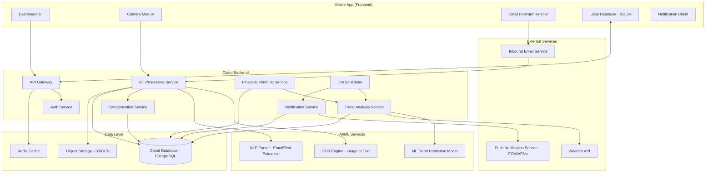
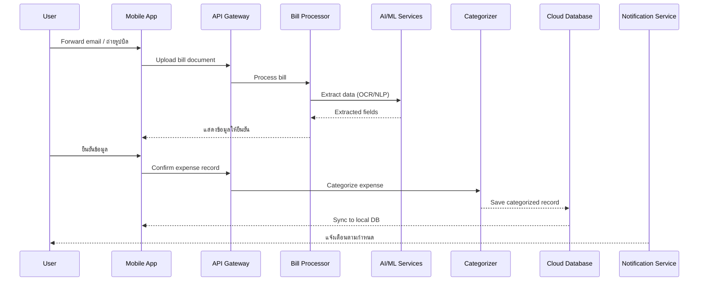
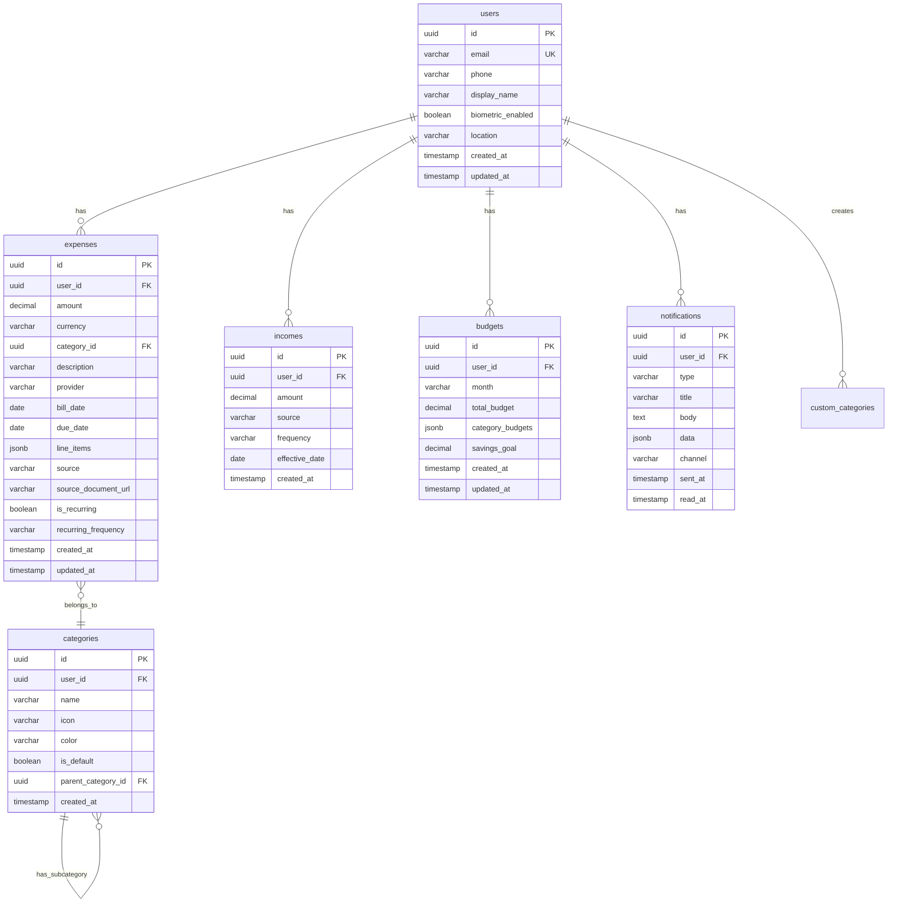

# Design Document - BillSense

## Overview

BillSense เป็น Mobile Application ที่ใช้ AI/ML ช่วยจัดการค่าใช้จ่ายครัวเรือน ระบบประกอบด้วย Mobile App (Frontend), Cloud Backend (API + Business Logic), AI/ML Services (Data Extraction, Categorization, Trend Analysis) และ Cloud Database

แนวคิดหลักคือ ผู้ใช้ส่งบิลเข้าระบบ (Forward อีเมลหรือถ่ายรูป) → AI สกัดข้อมูล → จัดหมวดหมู่อัตโนมัติ → วิเคราะห์แนวโน้ม → แจ้งเตือนและวางแผนการเงิน

### Design Decisions

1. **Event-Driven Architecture**: ใช้ event-driven pattern สำหรับ data pipeline เพื่อให้แต่ละ module ทำงานแยกกันได้ (loose coupling) เช่น เมื่อ Data_Extractor สกัดข้อมูลเสร็จ จะ emit event ให้ Expense_Categorizer ทำงานต่อ
2. **ML Model Serving**: ใช้ managed ML service (เช่น AWS SageMaker หรือ Google Cloud AI) สำหรับ OCR และ NLP แทนการ host model เอง เพื่อลด operational overhead
3. **Offline-First Mobile**: Mobile App ใช้ local database (SQLite/Realm) เป็น cache เพื่อให้ใช้งานได้แม้ไม่มี internet แล้ว sync กับ Cloud เมื่อ online
4. **Structured Data Format**: ใช้ JSON เป็น canonical format สำหรับ Expense_Record เพื่อรองรับ round-trip property ระหว่าง parse/display

## Architecture

### System Architecture Diagram



### Data Flow




## Components and Interfaces

### 1. Data Extractor Module

รับผิดชอบการสกัดข้อมูลจาก Bill_Document (อีเมลและรูปถ่าย) แปลงเป็น structured data

```typescript
interface DataExtractor {
  // สกัดข้อมูลจากอีเมลบิล
  extractFromEmail(emailContent: string): Promise<ExtractionResult>;
  
  // สกัดข้อมูลจากรูปถ่าย (base64 หรือ URL)
  extractFromImage(imageData: string): Promise<ExtractionResult>;
  
  // ตรวจสอบคุณภาพรูปถ่าย
  validateImageQuality(imageData: string): Promise<QualityCheckResult>;
}

interface ExtractionResult {
  success: boolean;
  confidence: number; // 0.0 - 1.0
  data: ExtractedBillData | null;
  errors: ExtractionError[];
}

interface ExtractedBillData {
  provider: string;        // ชื่อผู้ให้บริการ
  amount: number;          // จำนวนเงินรวม
  currency: string;        // สกุลเงิน (THB)
  dueDate: string | null;  // วันครบกำหนดชำระ (ISO 8601)
  lineItems: LineItem[];   // รายการย่อย (สำหรับสลิปซื้อของ)
  billDate: string;        // วันที่ในบิล
  rawText: string;         // ข้อความดิบที่สกัดได้
}

interface LineItem {
  description: string;
  amount: number;
  quantity: number;
}

interface QualityCheckResult {
  acceptable: boolean;
  issues: string[];        // เช่น "blurry", "too_dark", "rotated"
  suggestions: string[];   // คำแนะนำการถ่ายรูปใหม่
}
```

### 2. Expense Categorizer Module

จัดหมวดหมู่ค่าใช้จ่ายอัตโนมัติ พร้อมเรียนรู้จากการแก้ไขของผู้ใช้

```typescript
interface ExpenseCategorizer {
  // จัดหมวดหมู่ค่าใช้จ่าย
  categorize(record: ExpenseRecord): Promise<CategorizationResult>;
  
  // บันทึก feedback จากผู้ใช้เพื่อ improve model
  recordUserCorrection(recordId: string, correctCategory: string): Promise<void>;
  
  // ดึงรายการหมวดหมู่ทั้งหมด (default + custom)
  getCategories(userId: string): Promise<Category[]>;
  
  // สร้างหมวดหมู่ใหม่
  createCustomCategory(userId: string, category: CategoryInput): Promise<Category>;
}

interface CategorizationResult {
  categoryId: string;
  categoryName: string;
  confidence: number;      // 0.0 - 1.0
  needsUserConfirmation: boolean; // true ถ้า confidence < 0.7
  alternativeCategories: Array<{ categoryId: string; confidence: number }>;
}

interface Category {
  id: string;
  name: string;
  icon: string;
  isDefault: boolean;
  parentCategory: string | null; // สำหรับ sub-category
}
```

### 3. Trend Analyzer Module

วิเคราะห์แนวโน้มค่าใช้จ่ายโดยใช้ ML model ร่วมกับข้อมูลสภาพอากาศ

```typescript
interface TrendAnalyzer {
  // วิเคราะห์แนวโน้มรายหมวดหมู่
  analyzeTrend(userId: string, categoryId: string, months: number): Promise<TrendResult>;
  
  // คาดการณ์ค่าใช้จ่ายเดือนถัดไป
  predictNextMonth(userId: string): Promise<PredictionResult>;
  
  // ตรวจจับค่าใช้จ่ายที่เกิดเป็นรอบ
  detectRecurringExpenses(userId: string): Promise<RecurringExpense[]>;
  
  // ดึงข้อมูลสภาพอากาศสำหรับปรับ prediction
  getWeatherAdjustment(location: string, month: number): Promise<WeatherFactor>;
}

interface TrendResult {
  categoryId: string;
  direction: 'increasing' | 'decreasing' | 'stable';
  changePercentage: number;
  confidence: number;
  dataPoints: Array<{ month: string; amount: number }>;
  anomalies: Array<{ month: string; amount: number; reason: string }>;
}

interface PredictionResult {
  totalPredicted: number;
  confidence: number;
  byCategory: Array<{
    categoryId: string;
    predicted: number;
    confidence: number;
    weatherAdjusted: boolean;
  }>;
  warnings: PredictionWarning[];
}

interface RecurringExpense {
  description: string;
  amount: number;
  frequency: 'monthly' | 'quarterly' | 'yearly';
  nextDueDate: string;
  confidence: number;
}
```

### 4. Financial Planner Module

ประเมินค่าใช้จ่ายเทียบกับรายได้และวางแผนการเงิน

```typescript
interface FinancialPlanner {
  // คำนวณอัตราส่วนค่าใช้จ่ายต่อรายได้
  calculateExpenseRatio(userId: string, month: string): Promise<ExpenseRatio>;
  
  // สร้างแผนงบประมาณรายเดือน
  generateBudgetPlan(userId: string): Promise<BudgetPlan>;
  
  // คาดการณ์ค่าใช้จ่าย 3 เดือนข้างหน้า
  forecastExpenses(userId: string, months: number): Promise<ForecastResult>;
  
  // คำนวณงบประมาณจากเป้าหมายการออม
  calculateBudgetFromSavingsGoal(userId: string, savingsGoal: number): Promise<BudgetPlan>;
  
  // แนะนำหมวดหมู่ที่ลดค่าใช้จ่ายได้
  suggestCostReduction(userId: string): Promise<CostReductionSuggestion[]>;
}

interface ExpenseRatio {
  month: string;
  totalExpense: number;
  totalIncome: number;
  ratio: number;           // 0.0 - 1.0+
  isHealthy: boolean;      // true ถ้า ratio <= 0.7
  categoryBreakdown: Array<{ categoryId: string; amount: number; percentage: number }>;
}

interface BudgetPlan {
  month: string;
  totalBudget: number;
  byCategory: Array<{
    categoryId: string;
    budgetAmount: number;
    basedOn: 'historical' | 'trend' | 'savings_goal';
  }>;
  savingsTarget: number | null;
  lastUpdated: string;
}

interface CostReductionSuggestion {
  categoryId: string;
  currentAverage: number;
  suggestedBudget: number;
  potentialSaving: number;
  reason: string;
}
```

### 5. Notification Service

จัดการการแจ้งเตือนทุกประเภท

```typescript
interface NotificationService {
  // แจ้งเตือนบิลที่ใกล้ครบกำหนด
  sendBillDueReminder(userId: string, bill: RecurringExpense): Promise<void>;
  
  // แจ้งเตือนค่าใช้จ่ายที่คาดว่าจะเพิ่มขึ้น
  sendExpenseWarning(userId: string, warning: PredictionWarning): Promise<void>;
  
  // แจ้งเตือนงบประมาณใกล้หมด
  sendBudgetAlert(userId: string, budgetStatus: BudgetStatus): Promise<void>;
  
  // ดึงการตั้งค่าการแจ้งเตือนของผู้ใช้
  getNotificationPreferences(userId: string): Promise<NotificationPreferences>;
  
  // อัปเดตการตั้งค่าการแจ้งเตือน
  updateNotificationPreferences(userId: string, prefs: NotificationPreferences): Promise<void>;
}

interface NotificationPreferences {
  channels: Array<'push' | 'email'>;
  billReminder: { enabled: boolean; daysBefore: number };
  budgetAlert: { enabled: boolean; threshold: number }; // 0.0 - 1.0
  trendWarning: { enabled: boolean };
  yearlyExpenseReminder: { enabled: boolean; daysBefore: number };
}

interface BudgetStatus {
  month: string;
  budgetTotal: number;
  spentTotal: number;
  usagePercentage: number;
  overBudgetCategories: string[];
}
```

### 6. Bill Parser (Round-Trip)

แปลง Expense_Record ระหว่าง structured data (JSON) และ display format โดยรับประกัน round-trip property

```typescript
interface BillParser {
  // แปลง Expense_Record เป็น display string (Pretty Print)
  format(record: ExpenseRecord): string;
  
  // แปลง display string กลับเป็น Expense_Record
  parse(displayString: string): ExpenseRecord;
  
  // Serialize เป็น JSON
  serialize(record: ExpenseRecord): string;
  
  // Deserialize จาก JSON
  deserialize(json: string): ExpenseRecord;
}
```


## Data Models

### Core Data Models

```typescript
// ข้อมูลผู้ใช้
interface User {
  id: string;                    // UUID
  email: string;
  phone: string | null;
  displayName: string;
  biometricEnabled: boolean;
  location: string | null;       // สำหรับ weather-based prediction
  createdAt: string;             // ISO 8601
  updatedAt: string;
}

// ข้อมูลรายได้
interface Income {
  id: string;
  userId: string;
  amount: number;
  source: string;                // เช่น "เงินเดือน", "freelance"
  frequency: 'monthly' | 'one-time';
  effectiveDate: string;
  createdAt: string;
}

// Expense Record - โมเดลหลักของระบบ
interface ExpenseRecord {
  id: string;                    // UUID
  userId: string;
  amount: number;                // จำนวนเงินรวม (> 0)
  currency: string;              // "THB"
  categoryId: string;
  categoryName: string;
  description: string;
  provider: string | null;       // ชื่อผู้ให้บริการ
  billDate: string;              // วันที่ในบิล (ISO 8601)
  dueDate: string | null;        // วันครบกำหนดชำระ
  lineItems: LineItem[];         // รายการย่อย
  source: 'email' | 'photo' | 'manual';
  sourceDocumentUrl: string | null; // URL ของเอกสารต้นฉบับ
  isRecurring: boolean;
  recurringFrequency: 'monthly' | 'quarterly' | 'yearly' | null;
  createdAt: string;
  updatedAt: string;
}

// หมวดหมู่ค่าใช้จ่าย
interface Category {
  id: string;
  userId: string | null;         // null = default category
  name: string;
  icon: string;
  color: string;
  isDefault: boolean;
  parentCategoryId: string | null;
  createdAt: string;
}

// Default Categories
const DEFAULT_CATEGORIES = [
  { name: 'สาธารณูปโภค', subcategories: ['ค่าไฟ', 'ค่าน้ำ', 'ค่าเน็ต', 'ค่าโทรศัพท์'] },
  { name: 'ของใช้ในบ้าน', subcategories: [] },
  { name: 'อาหาร', subcategories: ['วัตถุดิบ', 'อาหารสำเร็จรูป'] },
  { name: 'ค่าเดินทาง', subcategories: ['น้ำมัน', 'ค่าทางด่วน', 'ขนส่งสาธารณะ'] },
  { name: 'ประกันภัย', subcategories: ['ประกันบ้าน', 'ประกันรถ', 'ประกันสุขภาพ'] },
  { name: 'ภาษี', subcategories: [] },
  { name: 'อื่นๆ', subcategories: [] },
];

// งบประมาณ
interface Budget {
  id: string;
  userId: string;
  month: string;                 // "YYYY-MM"
  totalBudget: number;
  categoryBudgets: Array<{
    categoryId: string;
    amount: number;
  }>;
  savingsGoal: number | null;
  createdAt: string;
  updatedAt: string;
}

// การแจ้งเตือน
interface Notification {
  id: string;
  userId: string;
  type: 'bill_due' | 'budget_alert' | 'trend_warning' | 'yearly_expense' | 'expense_ratio';
  title: string;
  body: string;
  data: Record<string, unknown>;
  channel: 'push' | 'email';
  sentAt: string;
  readAt: string | null;
}

// ข้อมูล Weather Factor สำหรับ Trend Analysis
interface WeatherFactor {
  location: string;
  month: number;
  avgTemperature: number;
  temperatureDeviation: number;  // ส่วนเบี่ยงเบนจากค่าเฉลี่ย
  electricityMultiplier: number; // ตัวคูณปรับค่าไฟ (1.0 = ปกติ)
}
```

### Database Schema (PostgreSQL)




## Correctness Properties

*Property คือคุณลักษณะหรือพฤติกรรมที่ควรเป็นจริงในทุกการทำงานที่ถูกต้องของระบบ เป็นข้อกำหนดเชิงรูปนัยเกี่ยวกับสิ่งที่ระบบควรทำ Properties ทำหน้าที่เป็นสะพานเชื่อมระหว่าง specification ที่มนุษย์อ่านได้กับการรับประกันความถูกต้องที่เครื่องตรวจสอบได้*

### Property 1: Expense Record Round-Trip (Serialization)

*For any* valid ExpenseRecord, การ serialize เป็น JSON แล้ว deserialize กลับ SHALL ให้ผลลัพธ์ที่เทียบเท่ากับ record ต้นฉบับ (serialize → deserialize = identity)

**Validates: Requirements 9.1, 9.3**

### Property 2: Expense Record Format Round-Trip (Display)

*For any* valid ExpenseRecord, การ format เป็น display string แล้ว parse กลับเป็น structured data SHALL ให้ผลลัพธ์ที่เทียบเท่ากับ record ต้นฉบับ (format → parse = identity)

**Validates: Requirements 9.2, 9.3**

### Property 3: Email Extraction Completeness

*For any* valid bill email content ที่มีข้อมูลบิล, ผลลัพธ์จาก Data_Extractor SHALL มี field amount (> 0), provider (non-empty), และ billDate (valid date) ครบถ้วน

**Validates: Requirements 1.1**

### Property 4: Image Extraction Line Items Consistency

*For any* valid receipt image ที่สกัดข้อมูลสำเร็จ, ผลรวมของ lineItems.amount ทุกรายการ SHALL เท่ากับ amount (ยอดรวม) ของ ExtractionResult

**Validates: Requirements 1.2**

### Property 5: Extraction Requires User Confirmation

*For any* successful extraction result, ระบบ SHALL อยู่ใน state "pending_confirmation" ก่อนที่จะบันทึกเป็น ExpenseRecord (ไม่มี auto-save โดยไม่ผ่านการยืนยัน)

**Validates: Requirements 1.3**

### Property 6: Auto-Categorization Assignment

*For any* valid ExpenseRecord ที่ถูกสร้างขึ้น, Expense_Categorizer SHALL assign category ที่มีอยู่ในระบบ (default หรือ custom) ให้เสมอ โดย result ต้องมี categoryId ที่ valid และ confidence ในช่วง 0.0-1.0

**Validates: Requirements 2.1, 2.4**

### Property 7: Low Confidence Triggers User Confirmation

*For any* CategorizationResult ที่มี confidence < 0.7, field needsUserConfirmation SHALL เป็น true และสำหรับ confidence >= 0.7 SHALL เป็น false

**Validates: Requirements 2.2**

### Property 8: User Correction Persistence

*For any* user category correction, ระบบ SHALL บันทึก correction เข้า training data โดยหลังจากบันทึก correction แล้ว query training data ด้วย recordId เดียวกัน SHALL ได้ correctCategory ที่ตรงกัน

**Validates: Requirements 2.3**

### Property 9: Dashboard Category Sum Equals Total

*For any* set of ExpenseRecords ในเดือนใดเดือนหนึ่ง, ผลรวมของค่าใช้จ่ายแยกตามหมวดหมู่ SHALL เท่ากับยอดค่าใช้จ่ายรวมของเดือนนั้น

**Validates: Requirements 3.1**

### Property 10: Category Filter Returns Correct Expenses

*For any* category และ set of ExpenseRecords, การ filter ด้วย categoryId SHALL return เฉพาะ records ที่มี categoryId ตรงกัน และจำนวน records ที่ return ต้องเท่ากับจำนวน records ที่มี categoryId นั้นใน dataset

**Validates: Requirements 3.3**

### Property 11: Historical Data Completeness

*For any* user ที่มีข้อมูลครบตามช่วงเวลาที่ร้องขอ, การ query ข้อมูลย้อนหลัง N เดือน SHALL return data points ครบ N เดือน โดยไม่มีเดือนที่หายไป

**Validates: Requirements 3.2, 6.4**

### Property 12: Trend Analysis Minimum Data Requirement

*For any* user dataset ที่มีข้อมูลน้อยกว่า 3 เดือน, Trend_Analyzer SHALL return result ที่ flag ว่า insufficient data และไม่ produce trend prediction

**Validates: Requirements 4.1**

### Property 13: Weather-Adjusted Electricity Prediction

*For any* WeatherFactor ที่มี temperatureDeviation ที่มีนัยสำคัญ (|deviation| > threshold), prediction ของค่าไฟฟ้า SHALL แตกต่างจาก base prediction (prediction ที่ไม่มี weather adjustment)

**Validates: Requirements 4.2**

### Property 14: Recurring Expense Detection

*For any* expense history ที่มี pattern ซ้ำๆ ในช่วงเวลาคงที่ (monthly/quarterly/yearly), Trend_Analyzer SHALL ตรวจจับ pattern นั้นและ return RecurringExpense ที่มี frequency ตรงกับ pattern จริง

**Validates: Requirements 4.3**

### Property 15: Trend Spike Warning Trigger

*For any* category expense data ที่ค่าใช้จ่ายเดือนปัจจุบันเกินค่าเฉลี่ย 3 เดือนล่าสุดมากกว่า 20%, ระบบ SHALL generate warning ที่ระบุ categoryId และ changePercentage ที่ถูกต้อง

**Validates: Requirements 4.4**

### Property 16: Prediction Confidence Range Invariant

*For any* PredictionResult หรือ TrendResult ที่ Trend_Analyzer สร้างขึ้น, confidence value SHALL อยู่ในช่วง [0.0, 1.0] เสมอ

**Validates: Requirements 4.5**

### Property 17: Notification Timing Based on Due Date

*For any* recurring expense ที่มี due date, Notification_Service SHALL trigger reminder ตาม lead time ที่กำหนด: 7 วันสำหรับ monthly/quarterly expenses และ 30 วันสำหรับ yearly expenses โดย notification ต้องมี billName, amount, และ dueDate ครบถ้วน

**Validates: Requirements 5.1, 5.3**

### Property 18: Predicted Expense Spike Notification

*For any* PredictionResult ที่ totalPredicted สูงกว่าค่าเฉลี่ย 3 เดือนล่าสุดเกิน 15%, Notification_Service SHALL generate notification พร้อมรายละเอียดค่าใช้จ่ายที่คาดว่าจะเพิ่มขึ้น

**Validates: Requirements 5.2**

### Property 19: Budget Threshold Alert

*For any* user ที่มี budget ตั้งไว้ เมื่อ cumulative spending ในเดือนปัจจุบัน >= 80% ของ totalBudget, Notification_Service SHALL trigger budget alert

**Validates: Requirements 5.4**

### Property 20: Expense Ratio Calculation and Warning

*For any* valid expenses และ income data, Financial_Planner SHALL คำนวณ ratio = totalExpense / totalIncome อย่างถูกต้อง และเมื่อ ratio > 0.7 ระบบ SHALL flag isHealthy = false พร้อม generate cost reduction suggestions

**Validates: Requirements 6.2, 6.3**

### Property 21: Income Storage Round-Trip

*For any* valid Income record ที่ผู้ใช้บันทึก, การ store แล้ว retrieve กลับมา SHALL ให้ข้อมูลที่เทียบเท่ากับ record ต้นฉบับ

**Validates: Requirements 6.1**

### Property 22: Budget Plan Category Coverage

*For any* expense history ของ user, budget plan ที่ Financial_Planner สร้าง SHALL มี categoryBudgets ที่ครอบคลุมทุก category ที่มีค่าใช้จ่ายใน history และ sum ของ categoryBudgets SHALL ไม่เกิน totalBudget

**Validates: Requirements 7.1**

### Property 23: Forecast Completeness

*For any* forecast request สำหรับ N เดือนข้างหน้า, Financial_Planner SHALL return predictions ครบ N เดือน โดยแต่ละเดือนมี breakdown ครบทุก active category

**Validates: Requirements 7.2**

### Property 24: Cost Reduction Suggestions Validity

*For any* expense history ที่มี category ที่ค่าใช้จ่ายสูงกว่าค่าเฉลี่ยย้อนหลัง, Financial_Planner SHALL suggest ลดค่าใช้จ่ายใน category นั้น โดย suggestedBudget < currentAverage และ potentialSaving > 0

**Validates: Requirements 7.3**

### Property 25: Savings Goal Budget Calculation

*For any* valid income และ savingsGoal (โดยที่ savingsGoal < income), Financial_Planner SHALL คำนวณ max monthly budget = income - savingsGoal และ budget plan ที่สร้างต้องมี totalBudget ไม่เกินค่านี้

**Validates: Requirements 7.4**

### Property 26: Budget Plan Auto-Update on New Expense

*For any* existing budget plan, เมื่อ ExpenseRecord ใหม่ถูกเพิ่มเข้าระบบ, budget plan SHALL ถูก update โดย lastUpdated timestamp ต้องเปลี่ยน

**Validates: Requirements 7.5**

### Property 27: Account Deletion Data Removal

*For any* user ที่ request account deletion, หลังจาก deletion process เสร็จสิ้น, query ข้อมูลด้วย userId นั้น SHALL return empty results สำหรับทุก table (expenses, incomes, budgets, notifications)

**Validates: Requirements 8.5**


## Error Handling

### Data Extraction Errors

| Error Case | Handling Strategy | User Feedback |
|---|---|---|
| รูปถ่ายคุณภาพต่ำ (เบลอ, มืด, เอียง) | `validateImageQuality()` ตรวจก่อน extract | แจ้งปัญหาพร้อมคำแนะนำถ่ายรูปใหม่ (Req 1.4) |
| อีเมลไม่มีข้อมูลบิล | `extractFromEmail()` return `success: false` | แจ้งว่าไม่พบข้อมูลบิลในอีเมล (Req 1.5) |
| OCR สกัดข้อมูลได้บางส่วน | Return partial data พร้อม low confidence | แสดงข้อมูลที่สกัดได้ ให้ผู้ใช้เติมส่วนที่ขาด |
| Network timeout ระหว่าง extraction | Retry 3 ครั้งด้วย exponential backoff | แจ้งให้ลองใหม่ หรือบันทึก offline แล้ว process ทีหลัง |

### Categorization Errors

| Error Case | Handling Strategy | User Feedback |
|---|---|---|
| Confidence ต่ำกว่า 70% | Flag `needsUserConfirmation: true` | แสดง top 3 categories ให้ผู้ใช้เลือก (Req 2.2) |
| ไม่มี category ที่เหมาะสม | Assign "อื่นๆ" พร้อม low confidence | แนะนำให้สร้าง custom category |
| Custom category ชื่อซ้ำ | Reject creation, return error | แจ้งว่าชื่อหมวดหมู่ซ้ำ |

### Trend Analysis Errors

| Error Case | Handling Strategy | User Feedback |
|---|---|---|
| ข้อมูลไม่ถึง 3 เดือน | Return `insufficient_data` flag | แจ้งว่าต้องใช้ข้อมูลอย่างน้อย 3 เดือน (Req 4.1) |
| Weather API ไม่ตอบ | ใช้ prediction โดยไม่มี weather adjustment | แสดง prediction พร้อมหมายเหตุว่าไม่รวมปัจจัยสภาพอากาศ |
| ML model prediction ล้มเหลว | Fallback เป็น simple moving average | แสดงผลพร้อม lower confidence |

### Financial Planning Errors

| Error Case | Handling Strategy | User Feedback |
|---|---|---|
| ไม่มีข้อมูลรายได้ | ข้ามการคำนวณ ratio | แสดงเฉพาะข้อมูลค่าใช้จ่าย (Req 6.5) |
| Savings goal > income | Reject, return validation error | แจ้งว่าเป้าหมายการออมเกินรายได้ |
| Division by zero (income = 0) | Return ratio = infinity, flag error | แจ้งให้บันทึกข้อมูลรายได้ |

### Security & Infrastructure Errors

| Error Case | Handling Strategy | User Feedback |
|---|---|---|
| Authentication failure | Lock account หลัง 5 ครั้ง, require email verification | แจ้งรหัสผ่านไม่ถูกต้อง |
| Cloud sync failure | Queue changes locally, retry เมื่อ online | แสดง sync status indicator |
| Data corruption detected | Restore จาก latest backup | แจ้งผู้ใช้ว่ากำลังกู้คืนข้อมูล |


## Testing Strategy

### ภาพรวม

ใช้ Dual Testing Approach ที่ประกอบด้วย Unit Tests และ Property-Based Tests ทำงานร่วมกัน:

- **Unit Tests**: ทดสอบ specific examples, edge cases, error conditions
- **Property-Based Tests**: ทดสอบ universal properties ข้าม inputs ทั้งหมด
- ทั้งสองแบบจำเป็นและเสริมกัน — unit tests จับ concrete bugs, property tests ตรวจสอบ general correctness

### Technology Stack สำหรับ Testing

| Component | Technology |
|---|---|
| Unit Testing Framework | Jest (TypeScript/Node.js backend), Jest + React Native Testing Library (Mobile) |
| Property-Based Testing Library | **fast-check** (TypeScript) |
| API Testing | Supertest |
| E2E Testing | Detox (React Native) |
| CI/CD | GitHub Actions |

### Property-Based Testing Configuration

- ใช้ **fast-check** เป็น PBT library สำหรับ TypeScript
- แต่ละ property test ต้อง run อย่างน้อย **100 iterations**
- แต่ละ property test ต้องมี comment อ้างอิง design property
- Tag format: **Feature: bill-sense, Property {number}: {property_text}**
- แต่ละ correctness property ต้อง implement ด้วย **single property-based test** เท่านั้น

### Unit Test Coverage

Unit tests ควรเน้นที่:

1. **Specific Examples**:
   - ทดสอบ extraction จากตัวอย่างอีเมลบิลค่าไฟ PEA, MEA
   - ทดสอบ extraction จากตัวอย่างสลิป 7-Eleven, Makro
   - ทดสอบ categorization ของ expense ที่รู้หมวดหมู่แน่นอน

2. **Edge Cases**:
   - รูปถ่ายคุณภาพต่ำ (Req 1.4)
   - อีเมลที่ไม่มีข้อมูลบิล (Req 1.5)
   - ผู้ใช้ไม่มีข้อมูลรายได้ (Req 6.5)
   - ข้อมูลน้อยกว่า 3 เดือนสำหรับ trend analysis (Req 4.1)
   - Budget = 0 หรือ income = 0

3. **Error Conditions**:
   - Network timeout ระหว่าง extraction
   - Weather API ไม่ตอบ
   - Invalid JSON format
   - Duplicate custom category names

4. **Integration Points**:
   - Data_Extractor → Expense_Categorizer pipeline
   - Trend_Analyzer → Notification_Service trigger
   - Financial_Planner → Budget auto-update flow
   - New device login → verification code flow (Req 8.3)

### Property Test Mapping

| Property | Test Description | fast-check Arbitraries |
|---|---|---|
| Property 1 | Serialize → Deserialize round-trip | `fc.record()` สำหรับ ExpenseRecord |
| Property 2 | Format → Parse round-trip | `fc.record()` สำหรับ ExpenseRecord |
| Property 3 | Email extraction field completeness | `fc.string()` สำหรับ valid bill email templates |
| Property 4 | Line items sum = total amount | `fc.array(fc.record())` สำหรับ LineItem[] |
| Property 5 | State = pending_confirmation after extraction | `fc.record()` สำหรับ ExtractionResult |
| Property 6 | Category always assigned | `fc.record()` สำหรับ ExpenseRecord |
| Property 7 | Confidence < 0.7 → needsUserConfirmation | `fc.float({min:0, max:1})` |
| Property 8 | Correction persisted correctly | `fc.record()` สำหรับ correction data |
| Property 9 | Category sums = total | `fc.array(fc.record())` สำหรับ ExpenseRecord[] |
| Property 10 | Category filter correctness | `fc.array(fc.record())` + `fc.string()` |
| Property 11 | Historical data point completeness | `fc.integer()` สำหรับ month count |
| Property 12 | Insufficient data flag | `fc.array()` with length < 3 |
| Property 13 | Weather deviation adjusts prediction | `fc.float()` สำหรับ temperature deviation |
| Property 14 | Recurring pattern detection | Synthetic recurring data generator |
| Property 15 | >20% spike triggers warning | `fc.array(fc.float())` สำหรับ monthly amounts |
| Property 16 | Confidence ∈ [0.0, 1.0] | `fc.record()` สำหรับ prediction inputs |
| Property 17 | Notification timing by frequency | `fc.date()` + `fc.constantFrom('monthly','yearly')` |
| Property 18 | >15% predicted spike → notification | `fc.float()` สำหรับ predicted vs average |
| Property 19 | >=80% budget → alert | `fc.float()` สำหรับ spending/budget ratio |
| Property 20 | Ratio calculation + >0.7 warning | `fc.float()` สำหรับ expense/income |
| Property 21 | Income store → retrieve round-trip | `fc.record()` สำหรับ Income |
| Property 22 | Budget covers all active categories | `fc.array(fc.record())` สำหรับ expense history |
| Property 23 | Forecast returns N months complete | `fc.integer({min:1, max:12})` |
| Property 24 | Suggestion: suggestedBudget < currentAvg | `fc.array(fc.float())` สำหรับ category amounts |
| Property 25 | Max budget = income - savingsGoal | `fc.float()` สำหรับ income, savingsGoal |
| Property 26 | Plan lastUpdated changes on new expense | `fc.record()` สำหรับ new ExpenseRecord |
| Property 27 | Deletion removes all user data | `fc.uuid()` สำหรับ userId |
