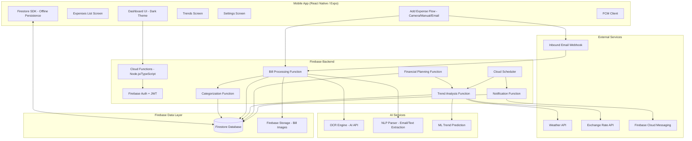
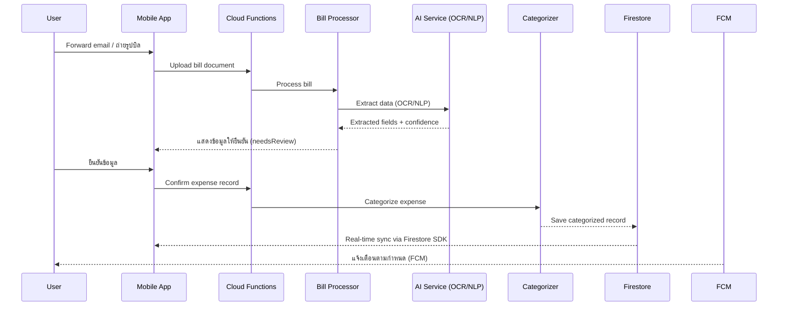
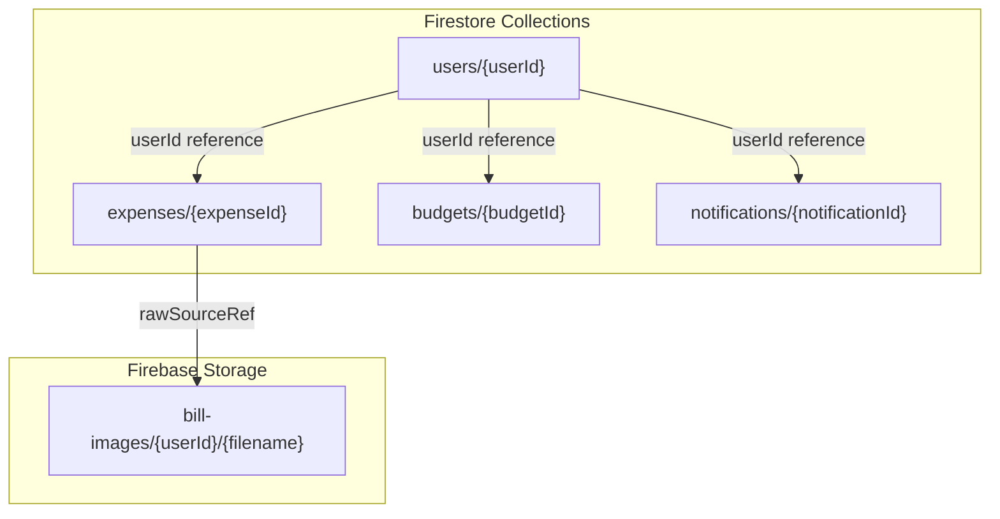
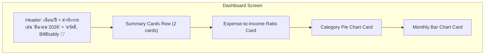
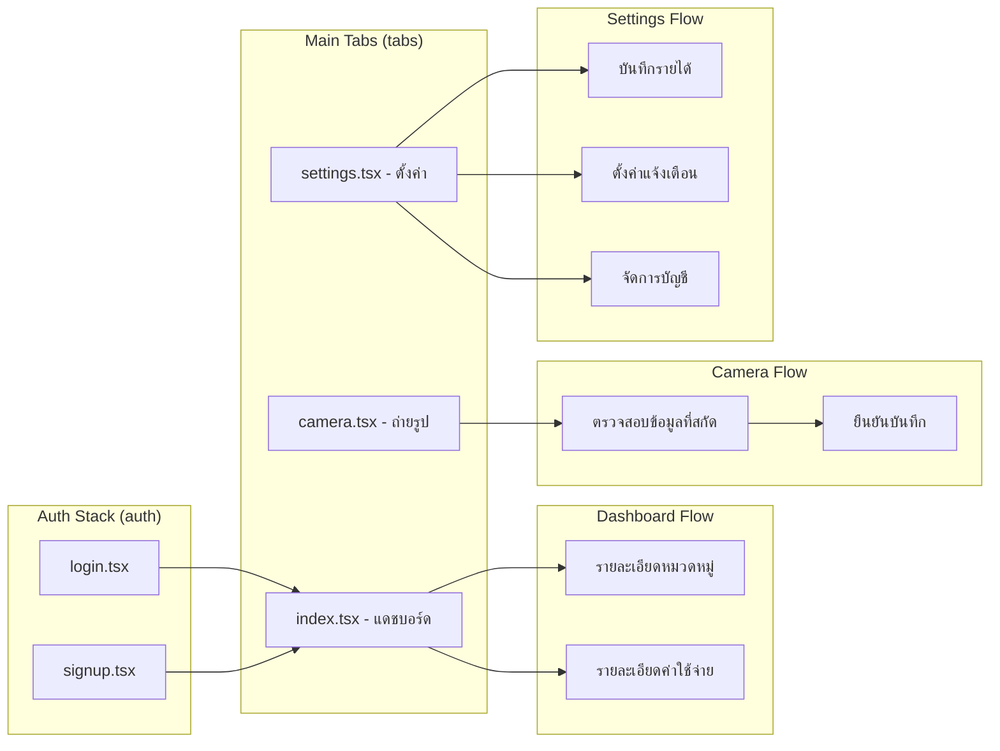

# Design Document - BillBuddy

## Overview

BillBuddy เป็น Mobile Application ที่ใช้ AI/ML ช่วยจัดการค่าใช้จ่ายครัวเรือน ระบบประกอบด้วย Mobile App (React Native/Expo), Firebase Backend (Cloud Functions + Firestore), AI/ML Services (Data Extraction, Categorization, Trend Analysis) และ Firebase Cloud Storage

แนวคิดหลักคือ ผู้ใช้ส่งบิลเข้าระบบ (Forward อีเมลหรือถ่ายรูป) → AI สกัดข้อมูล → จัดหมวดหมู่อัตโนมัติ → วิเคราะห์แนวโน้ม → แจ้งเตือนและวางแผนการเงิน

### Design Decisions

1. **Event-Driven Architecture**: ใช้ event-driven pattern สำหรับ data pipeline เพื่อให้แต่ละ module ทำงานแยกกันได้ (loose coupling) เช่น เมื่อ Data_Extractor สกัดข้อมูลเสร็จ จะ trigger Cloud Function ให้ Expense_Categorizer ทำงานต่อ
2. **Firebase-First Infrastructure**: ใช้ Firebase ecosystem ทั้งหมด (Firestore, Cloud Functions, Firebase Storage, FCM) เพื่อลด operational overhead และได้ real-time sync ฟรี
3. **AI via External API**: ใช้ external AI API (OpenAI หรือ custom model) สำหรับ OCR และ NLP แทนการ host model เอง โดยเรียกผ่าน Cloud Functions
4. **Offline-First Mobile**: Mobile App ใช้ Firestore offline persistence เป็น cache เพื่อให้ใช้งานได้แม้ไม่มี internet แล้ว sync อัตโนมัติเมื่อ online
5. **Structured Data Format**: ใช้ JSON เป็น canonical format สำหรับ Expense record เพื่อรองรับ round-trip property ระหว่าง parse/display
6. **Standardized API Responses**: ทุก API endpoint ใช้ format `{ "data": ..., "error": ... }` ตาม `ApiResponse<T>` interface

## Architecture

### System Architecture Diagram



### Data Flow




## Components and Interfaces

### 1. Data Extractor Module

รับผิดชอบการสกัดข้อมูลจาก Bill_Document (อีเมลและรูปถ่าย) แปลงเป็น structured data ทำงานเป็น Cloud Function ที่ trigger เมื่อมี upload หรือ email webhook

```typescript
// Aligned with functions/src/types/extraction.ts

interface ExtractionFieldResult<T> {
  value: T;
  confidence: number;  // 0.0 - 1.0
}

interface ExtractionResult {
  amount: ExtractionFieldResult<number>;
  category: ExtractionFieldResult<ExpenseCategory>;
  dueDate: ExtractionFieldResult<string>;
}

interface EmailWebhookPayload {
  from: string;
  subject: string;
  body: string;
  attachments?: Array<{
    filename: string;
    content: string;       // base64
    mimeType: string;
  }>;
}

interface ValidationResult {
  valid: boolean;
  errors: string[];
  needsReview: boolean;   // true เมื่อ confidence ต่ำ
}

interface DataExtractor {
  // สกัดข้อมูลจากอีเมลบิล
  extractFromEmail(payload: EmailWebhookPayload): Promise<ApiResponse<ExtractionResult>>;
  
  // สกัดข้อมูลจากรูปถ่าย (Firebase Storage URL)
  extractFromImage(storageUrl: string): Promise<ApiResponse<ExtractionResult>>;
  
  // ตรวจสอบคุณภาพรูปถ่าย
  validateImage(storageUrl: string): Promise<ValidationResult>;
}
```

### 2. Expense Categorizer Module

จัดหมวดหมู่ค่าใช้จ่ายอัตโนมัติ พร้อมเรียนรู้จากการแก้ไขของผู้ใช้

```typescript
// Aligned with functions/src/types/api.ts

type ExpenseCategory =
  | "electricity"
  | "water"
  | "insurance"
  | "loan"
  | "gas"
  | "manual";

interface CategorizationResult {
  category: ExpenseCategory;
  confidence: number;                    // 0.0 - 1.0
  needsUserConfirmation: boolean;        // true ถ้า confidence < 0.7
  alternatives: Array<{ category: ExpenseCategory; confidence: number }>;
}

interface ExpenseCategorizer {
  // จัดหมวดหมู่ค่าใช้จ่าย
  categorize(expense: CreateExpenseInput): Promise<CategorizationResult>;
  
  // บันทึก feedback จากผู้ใช้เพื่อ improve model
  recordUserCorrection(expenseId: string, correctCategory: ExpenseCategory): Promise<void>;
}
```

### 3. Trend Analyzer Module

วิเคราะห์แนวโน้มค่าใช้จ่ายโดยใช้ ML model ร่วมกับข้อมูลสภาพอากาศและปัจจัยเศรษฐกิจ

```typescript
// Aligned with functions/src/types/prediction.ts

interface PredictionContext {
  weatherImpact: string;
  economicFactor: number;
  exchangeRate?: number;
}

interface PredictionResult {
  category: ExpenseCategory;
  predictedMin: number;
  predictedMax: number;
  factors: PredictionContext;
}

interface TrendResult {
  category: ExpenseCategory;
  direction: "increasing" | "decreasing" | "stable";
  changePercentage: number;
  confidence: number;
  dataPoints: Array<{ month: string; amount: number }>;
}

interface RecurringExpense {
  category: ExpenseCategory;
  amount: number;
  frequency: "monthly" | "quarterly" | "yearly";
  nextDueDate: string;
  confidence: number;
}

interface TrendAnalyzer {
  // วิเคราะห์แนวโน้มรายหมวดหมู่
  analyzeTrend(userId: string, category: ExpenseCategory, months: number): Promise<TrendResult>;
  
  // คาดการณ์ค่าใช้จ่ายเดือนถัดไป
  predictNextMonth(userId: string): Promise<PredictionResult[]>;
  
  // ตรวจจับค่าใช้จ่ายที่เกิดเป็นรอบ
  detectRecurringExpenses(userId: string): Promise<RecurringExpense[]>;
  
  // ดึงข้อมูลสภาพอากาศสำหรับปรับ prediction
  getWeatherAdjustment(month: number): Promise<PredictionContext>;
}
```

### 4. Financial Planner Module

ประเมินค่าใช้จ่ายเทียบกับรายได้และวางแผนการเงิน

```typescript
interface ExpenseRatio {
  month: string;
  totalExpense: number;
  totalIncome: number;
  ratio: number;           // 0.0 - 1.0+
  isHealthy: boolean;      // true ถ้า ratio <= 0.7
  categoryBreakdown: Array<{ category: ExpenseCategory; amount: number; percentage: number }>;
}

interface BudgetPlan {
  month: string;
  totalBudget: number;
  byCategory: Array<{
    category: ExpenseCategory;
    budgetAmount: number;
    basedOn: "historical" | "trend" | "savings_goal";
  }>;
  savingsTarget: number | null;
  lastUpdated: string;
}

interface CostReductionSuggestion {
  category: ExpenseCategory;
  currentAverage: number;
  suggestedBudget: number;
  potentialSaving: number;
  reason: string;
}

interface FinancialPlanner {
  // คำนวณอัตราส่วนค่าใช้จ่ายต่อรายได้
  calculateExpenseRatio(userId: string, month: string): Promise<ExpenseRatio>;
  
  // สร้างแผนงบประมาณรายเดือน
  generateBudgetPlan(userId: string): Promise<BudgetPlan>;
  
  // คาดการณ์ค่าใช้จ่าย N เดือนข้างหน้า
  forecastExpenses(userId: string, months: number): Promise<PredictionResult[][]>;
  
  // คำนวณงบประมาณจากเป้าหมายการออม
  calculateBudgetFromSavingsGoal(userId: string, savingsGoal: number): Promise<BudgetPlan>;
  
  // แนะนำหมวดหมู่ที่ลดค่าใช้จ่ายได้
  suggestCostReduction(userId: string): Promise<CostReductionSuggestion[]>;
}
```

### 5. Notification Service

จัดการการแจ้งเตือนทุกประเภทผ่าน Firebase Cloud Messaging (FCM)

```typescript
interface NotificationPreferences {
  channels: Array<"push" | "email">;
  billReminder: { enabled: boolean; daysBefore: number };
  budgetAlert: { enabled: boolean; threshold: number };  // 0.0 - 1.0
  trendWarning: { enabled: boolean };
  yearlyExpenseReminder: { enabled: boolean; daysBefore: number };
}

interface BudgetStatus {
  month: string;
  budgetTotal: number;
  spentTotal: number;
  usagePercentage: number;
  overBudgetCategories: ExpenseCategory[];
}

interface NotificationService {
  // แจ้งเตือนบิลที่ใกล้ครบกำหนด
  sendBillDueReminder(userId: string, bill: RecurringExpense): Promise<void>;
  
  // แจ้งเตือนค่าใช้จ่ายที่คาดว่าจะเพิ่มขึ้น
  sendExpenseWarning(userId: string, prediction: PredictionResult): Promise<void>;
  
  // แจ้งเตือนงบประมาณใกล้หมด
  sendBudgetAlert(userId: string, budgetStatus: BudgetStatus): Promise<void>;
  
  // ดึง/อัปเดตการตั้งค่าการแจ้งเตือน
  getNotificationPreferences(userId: string): Promise<NotificationPreferences>;
  updateNotificationPreferences(userId: string, prefs: NotificationPreferences): Promise<void>;
}
```

### 6. Bill Parser (Round-Trip)

แปลง Expense record ระหว่าง structured data (JSON) และ display format โดยรับประกัน round-trip property

```typescript
interface BillParser {
  // แปลง Expense เป็น display string (Pretty Print)
  format(expense: Expense): string;
  
  // แปลง display string กลับเป็น Expense
  parse(displayString: string): Expense;
  
  // Serialize เป็น JSON
  serialize(expense: Expense): string;
  
  // Deserialize จาก JSON
  deserialize(json: string): Expense;
}
```

### 7. Firestore Abstraction Layer

Abstraction layer สำหรับ Firestore operations ใช้ in-memory store สำหรับ testing

```typescript
// Aligned with functions/src/services/firestore.ts

interface FirestoreStore<T> {
  get(id: string): Promise<T | undefined>;
  findBy(field: keyof T, value: unknown): Promise<T | undefined>;
  set(id: string, data: T): Promise<void>;
  delete(id: string): Promise<boolean>;
  getAll(): Promise<T[]>;
}
```


## Data Models

### Core Data Models (Firestore Collections)

```typescript
// Aligned with functions/src/types/ and billbuddy/types/

// === API Types (shared) ===

interface ApiResponse<T> {
  data: T | null;
  error: string | null;
}

type ExpenseCategory =
  | "electricity"
  | "water"
  | "insurance"
  | "loan"
  | "gas"
  | "manual";

type ExtractionSource = "email" | "image" | "manual";

// === Collection: users ===
interface User {
  id: string;                    // UUID (Firestore document ID)
  email: string;
  monthlyIncome: number | null;  // null ถ้ายังไม่ได้บันทึกรายได้
  createdAt: string;             // ISO 8601
}

// === Collection: expenses ===
interface Expense {
  id: string;                    // UUID (Firestore document ID)
  userId: string;                // Reference to users collection
  category: ExpenseCategory;
  amount: number;                // จำนวนเงิน (> 0)
  currency: "THB";
  dueDate: string;               // วันครบกำหนดชำระ (ISO 8601)
  isPaid: boolean;
  extractedVia: ExtractionSource;
  rawSourceRef?: string;         // Firebase Storage URL ของเอกสารต้นฉบับ
  needsReview?: boolean;         // true เมื่อ extraction confidence ต่ำ
  createdAt: string;             // ISO 8601
}

interface CreateExpenseInput {
  category: ExpenseCategory;
  amount: number;
  dueDate: string;
  isPaid: boolean;
  extractedVia: ExtractionSource;
  rawSourceRef?: string;
}

interface ExpenseFilters {
  category?: ExpenseCategory;
  month?: number;
  year?: number;
  isPaid?: boolean;
}

// === Collection: budgets ===
interface Budget {
  id: string;
  userId: string;
  month: string;                 // "YYYY-MM"
  totalBudget: number;
  categoryBudgets: Array<{
    category: ExpenseCategory;
    amount: number;
  }>;
  savingsGoal: number | null;
  createdAt: string;
  updatedAt: string;
}

// === Collection: notifications ===
interface Notification {
  id: string;
  userId: string;
  type: "bill_due" | "budget_alert" | "trend_warning" | "yearly_expense" | "expense_ratio";
  title: string;
  body: string;
  data: Record<string, unknown>;
  channel: "push" | "email";
  sentAt: string;
  readAt: string | null;
}

// === Prediction Context (used by Trend Analyzer) ===
interface PredictionContext {
  weatherImpact: string;
  economicFactor: number;
  exchangeRate?: number;
}
```

### Firestore Collection Structure



### Firestore Security Rules (Conceptual)

```
// ทุก query ต้อง scope ด้วย authenticated userId (ป้องกัน IDOR)
match /expenses/{expenseId} {
  allow read, write: if request.auth != null 
    && resource.data.userId == request.auth.uid;
}
match /budgets/{budgetId} {
  allow read, write: if request.auth != null 
    && resource.data.userId == request.auth.uid;
}
match /notifications/{notifId} {
  allow read, write: if request.auth != null 
    && resource.data.userId == request.auth.uid;
}
```


## UI/UX Design

### Design Theme

แอปใช้ธีม Dark Mode เป็นหลัก สร้างความรู้สึกทันสมัยและอ่านง่ายสำหรับข้อมูลการเงิน

#### Color Palette

| Token | Hex | Usage |
|---|---|---|
| `background.primary` | `#1A1A2E` | พื้นหลังหลักของแอป (dark navy) |
| `background.card` | `#16213E` | พื้นหลัง card components |
| `accent.green` | `#0F9D58` | Primary action, ปุ่มเพิ่ม, card ค่าใช้จ่ายเดือนนี้ |
| `accent.greenLight` | `#27AE60` | Hover/active state ของ green elements |
| `text.primary` | `#FFFFFF` | ข้อความหลักบน dark background |
| `text.secondary` | `#A0A0B8` | ข้อความรอง, labels |
| `text.muted` | `#6C6C80` | ข้อความ disabled/placeholder |
| `status.healthy` | `#0F9D58` | สถานะดี (อัตราส่วนค่าใช้จ่ายอยู่ในเกณฑ์) |
| `status.warning` | `#F39C12` | สถานะเตือน |
| `status.critical` | `#E74C3C` | สถานะวิกฤต |
| `chart.electricity` | `#F39C12` | หมวดค่าไฟ (ส้ม) |
| `chart.water` | `#3498DB` | หมวดค่าน้ำ (น้ำเงิน) |
| `chart.insurance` | `#E91E8C` | หมวดประกัน (ชมพู) |
| `chart.loan` | `#E74C3C` | หมวดสินเชื่อ (แดง) |
| `chart.gas` | `#2ECC71` | หมวดน้ำมัน (เขียว) |
| `chart.manual` | `#9B59B6` | หมวดอื่นๆ (ม่วง) |

#### Typography

- ใช้ system font (San Francisco บน iOS, Roboto บน Android) รองรับภาษาไทยเต็มรูปแบบ
- ขนาดตัวอักษร: heading 24-28px, subheading 16-18px, body 14px, caption 12px
- น้ำหนัก: Bold สำหรับตัวเลขเงิน, SemiBold สำหรับ heading, Regular สำหรับ body

#### Component Styling

- Card: `borderRadius: 16`, `backgroundColor: background.card`, subtle shadow (`elevation: 4`)
- ปุ่ม: `borderRadius: 28` (pill shape สำหรับ FAB), `borderRadius: 12` สำหรับปุ่มทั่วไป
- Spacing: ใช้ 8px grid system (padding/margin เป็นทวีคูณของ 8)

### Dashboard Layout (หน้าหลัก)

หน้า Dashboard เป็นหน้าแรกที่ผู้ใช้เห็นเมื่อเปิดแอป แสดงภาพรวมการเงินทั้งหมด



#### 1. Header Section

- แสดงเดือน/ปีปัจจุบัน (ภาษาไทย เช่น "มีนาคม 2026")
- คำทักทาย: "สวัสดี, BillBuddy 👋"
- ไม่มี navigation bar ด้านบน (ใช้ bottom tabs แทน)

#### 2. Summary Cards Row (แถวการ์ดสรุป)

แสดง 2 การ์ดเรียงข้างกัน (horizontal, flex-row, gap: 12):

| การ์ด | พื้นหลัง | เนื้อหา |
|---|---|---|
| ค่าใช้จ่ายเดือนนี้ | `accent.green` (เขียว) | ยอดรวม (เช่น ฿22,019) + trend indicator (เช่น "+9.5% จากเดือนก่อน") |
| งบคงเหลือ | `background.card` (dark card) | ยอดคงเหลือ (เช่น ฿2,981) + subtitle "จาก ฿25,000" |

- ยอดเงินแสดงด้วย font-size ใหญ่ (24-28px, bold)
- Trend indicator ใช้สีเขียว/แดงตามทิศทาง

#### 3. Expense-to-Income Ratio Card (การ์ดสัดส่วนรายจ่าย/รายได้)

- Title: "สัดส่วนรายจ่าย/รายได้"
- แสดงเปอร์เซ็นต์ขนาดใหญ่ (เช่น "49%")
- Progress bar หรือ circular indicator แสดงสัดส่วน
- สถานะ: "อยู่ในเกณฑ์ที่ดี" (เขียว) เมื่อ ratio ≤ 70%, "ควรระวัง" (ส้ม) เมื่อ 70-90%, "เกินงบ" (แดง) เมื่อ > 90%
- ซ่อนการ์ดนี้เมื่อ `user.monthlyIncome === null` (Req 6.5)

#### 4. Category Pie Chart Card (แผนภูมิวงกลมหมวดหมู่)

- Title: "ค่าใช้จ่ายตามหมวดหมู่"
- Donut chart แสดงสัดส่วนค่าใช้จ่ายแต่ละหมวด
- Legend แสดงข้างขวาของ chart:
  - ค่าไฟ (ส้ม) - electricity
  - ค่าน้ำ (น้ำเงิน) - water
  - ประกัน (ชมพู) - insurance
  - สินเชื่อ (แดง) - loan
  - น้ำมัน (เขียว) - gas
  - อื่นๆ (ม่วง) - manual
- แต่ละรายการแสดง ชื่อหมวด + เปอร์เซ็นต์
- กดที่หมวดหมู่เพื่อดูรายละเอียด (Req 3.3)

#### 5. Monthly Bar Chart Card (กราฟแท่งรายเดือน)

- Title: "ค่าใช้จ่ายรายเดือน"
- Bar chart แสดงค่าใช้จ่ายย้อนหลัง 6 เดือน (แสดงชื่อเดือนย่อภาษาไทย เช่น ต.ค., พ.ย., ธ.ค., ม.ค., ก.พ., มี.ค.)
- แท่งเดือนปัจจุบันเน้นด้วยสี `accent.green`
- แท่งเดือนอื่นใช้สี `text.muted`

### Bottom Tab Navigation (แถบนำทางด้านล่าง)

แอปใช้ 4 tabs ที่ด้านล่างหน้าจอ (ตาม Expo Router layout):

| Tab | ชื่อ (ไทย) | Route | Icon | หมายเหตุ |
|---|---|---|---|---|
| Dashboard | แดชบอร์ด | `(tabs)/index` | grid icon | หน้าหลัก, แสดง overview |
| Camera | ถ่ายรูป | `(tabs)/camera` | camera icon | ถ่ายรูปสลิป/บิล |
| Settings | ตั้งค่า | `(tabs)/settings` | gear icon | ตั้งค่าบัญชี, รายได้ |

- Tab bar background: `#0F0F23` (เข้มกว่า background หลัก)
- Active tab: `accent.green` สำหรับ icon + label
- Inactive tab: `text.muted`

### Screen Map



### Responsive Design

- Mobile-first design, optimized สำหรับหน้าจอ 375-428px width
- Summary cards ใช้ `flex-row` บนหน้าจอปกติ, stack เป็น `flex-col` บนหน้าจอแคบมาก (< 320px)
- Charts ปรับขนาดตาม container width
- Safe area insets สำหรับ notch/dynamic island (iOS) และ navigation bar (Android)


## Correctness Properties

*Property คือคุณลักษณะหรือพฤติกรรมที่ควรเป็นจริงในทุกการทำงานที่ถูกต้องของระบบ เป็นข้อกำหนดเชิงรูปนัยเกี่ยวกับสิ่งที่ระบบควรทำ Properties ทำหน้าที่เป็นสะพานเชื่อมระหว่าง specification ที่มนุษย์อ่านได้กับการรับประกันความถูกต้องที่เครื่องตรวจสอบได้*

### Property 1: Expense Record Round-Trip (Serialization)

*For any* valid Expense object, serializing to JSON via `serialize()` then deserializing back via `deserialize()` SHALL produce an object equivalent to the original (serialize → deserialize = identity)

**Validates: Requirements 9.1, 9.3**

### Property 2: Expense Record Format Round-Trip (Display)

*For any* valid Expense object, formatting to a display string via `format()` then parsing back via `parse()` SHALL produce an object equivalent to the original (format → parse = identity)

**Validates: Requirements 9.2, 9.3**

### Property 3: Email Extraction Completeness

*For any* valid bill email payload containing bill information, the ExtractionResult from Data_Extractor SHALL contain: amount.value > 0, dueDate.value as a valid ISO date string, and category.value as a valid ExpenseCategory

**Validates: Requirements 1.1**

### Property 4: Image Extraction Line Items Consistency

*For any* valid receipt image extraction that produces line items, the sum of all individual line item amounts SHALL equal the total amount in the ExtractionResult

**Validates: Requirements 1.2**

### Property 5: Extraction Requires User Confirmation

*For any* successful extraction result, the resulting expense record SHALL have `needsReview = true` before user confirmation — no auto-save without explicit user approval

**Validates: Requirements 1.3**

### Property 6: Auto-Categorization Assignment

*For any* valid CreateExpenseInput, the Expense_Categorizer SHALL assign a category that is a valid ExpenseCategory value, with confidence in the range [0.0, 1.0]

**Validates: Requirements 2.1, 2.4**

### Property 7: Low Confidence Triggers User Confirmation

*For any* CategorizationResult where confidence < 0.7, the field `needsUserConfirmation` SHALL be true; and for confidence >= 0.7, it SHALL be false

**Validates: Requirements 2.2**

### Property 8: User Correction Persistence

*For any* user category correction (expenseId + correctCategory), after recording the correction, querying the correction store with the same expenseId SHALL return the matching correctCategory

**Validates: Requirements 2.3**

### Property 9: Dashboard Category Sum Equals Total

*For any* set of Expense records in a given month, the sum of amounts grouped by category SHALL equal the total expense amount for that month

**Validates: Requirements 3.1**

### Property 10: Category Filter Returns Correct Expenses

*For any* ExpenseCategory filter and set of Expense records, filtering by that category SHALL return only records whose `category` field matches, and the count SHALL equal the number of matching records in the original dataset

**Validates: Requirements 3.3**

### Property 11: Historical Data Completeness

*For any* user with expense data spanning the requested time range, querying N months of historical data SHALL return exactly N data points with no missing months

**Validates: Requirements 3.2, 6.4**

### Property 12: Trend Analysis Minimum Data Requirement

*For any* user dataset with fewer than 3 months of expense data, the Trend_Analyzer SHALL return a result flagged as insufficient data and SHALL NOT produce a trend prediction

**Validates: Requirements 4.1**

### Property 13: Weather-Adjusted Electricity Prediction

*For any* PredictionContext where weatherImpact indicates significant temperature deviation, the electricity prediction SHALL differ from the base prediction (prediction without weather adjustment)

**Validates: Requirements 4.2**

### Property 14: Recurring Expense Detection

*For any* expense history containing a repeating pattern at a fixed interval (monthly/quarterly/yearly), the Trend_Analyzer SHALL detect that pattern and return a RecurringExpense with the correct frequency

**Validates: Requirements 4.3**

### Property 15: Trend Spike Warning Trigger

*For any* category expense data where the current month's total exceeds the 3-month rolling average by more than 20%, the system SHALL generate a warning specifying the correct category and changePercentage

**Validates: Requirements 4.4**

### Property 16: Prediction Confidence Range Invariant

*For any* PredictionResult or TrendResult produced by the Trend_Analyzer, the confidence value SHALL be in the range [0.0, 1.0]

**Validates: Requirements 4.5**

### Property 17: Notification Timing Based on Due Date

*For any* recurring expense with a due date, the Notification_Service SHALL trigger a reminder with the correct lead time: 7 days before for monthly/quarterly expenses, and 30 days before for yearly expenses. The notification SHALL contain the bill name, amount, and dueDate

**Validates: Requirements 5.1, 5.3**

### Property 18: Predicted Expense Spike Notification

*For any* PredictionResult where the predicted total exceeds the 3-month average by more than 15%, the Notification_Service SHALL generate a notification with details of the expected increase

**Validates: Requirements 5.2**

### Property 19: Budget Threshold Alert

*For any* user with a budget set, when cumulative spending in the current month reaches >= 80% of totalBudget, the Notification_Service SHALL trigger a budget alert

**Validates: Requirements 5.4**

### Property 20: Expense Ratio Calculation and Warning

*For any* valid expense and income data, the Financial_Planner SHALL calculate ratio = totalExpense / totalIncome correctly, and when ratio > 0.7, isHealthy SHALL be false with cost reduction suggestions generated

**Validates: Requirements 6.2, 6.3**

### Property 21: Income Storage Round-Trip

*For any* valid income value stored for a user (via `monthlyIncome` field), retrieving the user record SHALL return the same income value

**Validates: Requirements 6.1**

### Property 22: Budget Plan Category Coverage

*For any* user's expense history, the budget plan generated by Financial_Planner SHALL include categoryBudgets covering every category present in the history, and the sum of categoryBudgets SHALL NOT exceed totalBudget

**Validates: Requirements 7.1**

### Property 23: Forecast Completeness

*For any* forecast request for N months ahead, the Financial_Planner SHALL return predictions for exactly N months, each with a breakdown covering all active categories

**Validates: Requirements 7.2**

### Property 24: Cost Reduction Suggestions Validity

*For any* expense history with categories exceeding their historical average, the Financial_Planner SHALL suggest reductions where suggestedBudget < currentAverage and potentialSaving > 0

**Validates: Requirements 7.3**

### Property 25: Savings Goal Budget Calculation

*For any* valid income and savingsGoal (where savingsGoal < income), the Financial_Planner SHALL calculate max monthly budget = income - savingsGoal, and the generated budget plan's totalBudget SHALL NOT exceed this value

**Validates: Requirements 7.4**

### Property 26: Budget Plan Auto-Update on New Expense

*For any* existing budget plan, when a new Expense record is added, the budget plan SHALL be updated with a changed `lastUpdated` timestamp

**Validates: Requirements 7.5**

### Property 27: Account Deletion Data Removal

*For any* user who requests account deletion, after the deletion process completes, querying all Firestore collections (expenses, budgets, notifications) with that userId SHALL return empty results

**Validates: Requirements 8.5**


## Error Handling

### Data Extraction Errors

| Error Case | Handling Strategy | User Feedback |
|---|---|---|
| รูปถ่ายคุณภาพต่ำ (เบลอ, มืด, เอียง) | `validateImage()` ตรวจก่อน extract, return `ValidationResult` with errors | แจ้งปัญหาพร้อมคำแนะนำถ่ายรูปใหม่ (Req 1.4) |
| อีเมลไม่มีข้อมูลบิล | `extractFromEmail()` return `ApiResponse` with error | แจ้งว่าไม่พบข้อมูลบิลในอีเมล (Req 1.5) |
| OCR สกัดข้อมูลได้บางส่วน | Return partial data พร้อม low confidence, set `needsReview: true` | แสดงข้อมูลที่สกัดได้ ให้ผู้ใช้เติมส่วนที่ขาด |
| AI Service API timeout | Retry 3 ครั้งด้วย exponential backoff | แจ้งให้ลองใหม่ หรือใช้ manual entry |
| Firebase Storage upload failure | Queue locally, retry เมื่อ online | แสดง upload status indicator |

### Categorization Errors

| Error Case | Handling Strategy | User Feedback |
|---|---|---|
| Confidence ต่ำกว่า 70% | Flag `needsUserConfirmation: true` | แสดง alternatives ให้ผู้ใช้เลือก (Req 2.2) |
| ไม่มี category ที่เหมาะสม | Assign "manual" พร้อม low confidence | แนะนำให้ผู้ใช้เลือกหมวดหมู่ |

### Trend Analysis Errors

| Error Case | Handling Strategy | User Feedback |
|---|---|---|
| ข้อมูลไม่ถึง 3 เดือน | Return `insufficient_data` flag | แจ้งว่าต้องใช้ข้อมูลอย่างน้อย 3 เดือน (Req 4.1) |
| Weather API ไม่ตอบ | ใช้ prediction โดยไม่มี weather adjustment | แสดง prediction พร้อมหมายเหตุว่าไม่รวมปัจจัยสภาพอากาศ |
| Exchange Rate API ไม่ตอบ | ใช้ last known rate หรือ skip factor | แสดง prediction พร้อมหมายเหตุ |
| ML prediction ล้มเหลว | Fallback เป็น simple moving average | แสดงผลพร้อม lower confidence |

### Financial Planning Errors

| Error Case | Handling Strategy | User Feedback |
|---|---|---|
| ไม่มีข้อมูลรายได้ (`monthlyIncome === null`) | ข้ามการคำนวณ ratio, ซ่อน ratio card | แสดงเฉพาะข้อมูลค่าใช้จ่าย (Req 6.5) |
| Savings goal > income | Reject, return `ApiResponse` with error | แจ้งว่าเป้าหมายการออมเกินรายได้ |
| Division by zero (income = 0) | Return ratio = infinity, flag error | แจ้งให้บันทึกข้อมูลรายได้ |

### Security & Infrastructure Errors

| Error Case | Handling Strategy | User Feedback |
|---|---|---|
| Firebase Auth failure | Lock account หลัง 5 ครั้ง, require email verification | แจ้งรหัสผ่านไม่ถูกต้อง |
| Firestore sync failure | ใช้ offline persistence, queue changes | แสดง sync status indicator |
| JWT token expired | Auto-refresh via Firebase Auth SDK | Transparent to user |
| Uploaded image contains PII | Temporarily store, scrub after extraction | ไม่แจ้งผู้ใช้ (background process) |


## Testing Strategy

### ภาพรวม

ใช้ Dual Testing Approach ที่ประกอบด้วย Unit Tests และ Property-Based Tests ทำงานร่วมกัน:

- **Unit Tests**: ทดสอบ specific examples, edge cases, error conditions
- **Property-Based Tests**: ทดสอบ universal properties ข้าม inputs ทั้งหมด
- ทั้งสองแบบจำเป็นและเสริมกัน — unit tests จับ concrete bugs, property tests ตรวจสอบ general correctness

### Technology Stack สำหรับ Testing

| Component | Technology |
|---|---|
| Unit Testing Framework | Jest (TypeScript/Node.js backend) |
| Property-Based Testing Library | **fast-check** (TypeScript) |
| API Testing | Supertest |
| CI/CD | GitHub Actions |

### Property-Based Testing Configuration

- ใช้ **fast-check** เป็น PBT library สำหรับ TypeScript
- ห้าม implement property-based testing จาก scratch — ต้องใช้ fast-check library เท่านั้น
- แต่ละ property test ต้อง run อย่างน้อย **100 iterations**
- แต่ละ property test ต้องมี comment อ้างอิง design property
- Tag format: **Feature: billbuddy-mvp, Property {number}: {property_text}**
- แต่ละ correctness property ต้อง implement ด้วย **single property-based test** เท่านั้น

### Unit Test Coverage

Unit tests ควรเน้นที่:

1. **Specific Examples**:
   - ทดสอบ extraction จากตัวอย่างอีเมลบิลค่าไฟ PEA, MEA
   - ทดสอบ extraction จากตัวอย่างสลิป 7-Eleven, Makro
   - ทดสอบ categorization ของ expense ที่รู้หมวดหมู่แน่นอน

2. **Edge Cases**:
   - รูปถ่ายคุณภาพต่ำ (Req 1.4)
   - อีเมลที่ไม่มีข้อมูลบิล (Req 1.5)
   - ผู้ใช้ไม่มีข้อมูลรายได้ / `monthlyIncome === null` (Req 6.5)
   - ข้อมูลน้อยกว่า 3 เดือนสำหรับ trend analysis (Req 4.1)
   - Budget = 0 หรือ income = 0

3. **Error Conditions**:
   - AI Service API timeout
   - Weather API / Exchange Rate API ไม่ตอบ
   - Invalid JSON format
   - Firebase Auth failure

4. **Integration Points**:
   - Data_Extractor → Expense_Categorizer pipeline
   - Trend_Analyzer → Notification_Service trigger
   - Financial_Planner → Budget auto-update flow

### Property Test Mapping

| Property | Test Description | fast-check Arbitraries |
|---|---|---|
| Property 1 | Serialize → Deserialize round-trip | `fc.record()` สำหรับ Expense |
| Property 2 | Format → Parse round-trip | `fc.record()` สำหรับ Expense |
| Property 3 | Email extraction field completeness | `fc.string()` สำหรับ valid bill email templates |
| Property 4 | Line items sum = total amount | `fc.array(fc.record())` สำหรับ line items |
| Property 5 | State = needsReview after extraction | `fc.record()` สำหรับ ExtractionResult |
| Property 6 | Category always assigned as valid ExpenseCategory | `fc.record()` สำหรับ CreateExpenseInput |
| Property 7 | Confidence < 0.7 → needsUserConfirmation | `fc.float({min:0, max:1})` |
| Property 8 | Correction persisted correctly | `fc.record()` สำหรับ correction data |
| Property 9 | Category sums = total | `fc.array(fc.record())` สำหรับ Expense[] |
| Property 10 | Category filter correctness | `fc.array(fc.record())` + `fc.constantFrom(...categories)` |
| Property 11 | Historical data point completeness | `fc.integer({min:1, max:12})` |
| Property 12 | Insufficient data flag | `fc.array()` with length < 3 |
| Property 13 | Weather deviation adjusts prediction | `fc.record()` สำหรับ PredictionContext |
| Property 14 | Recurring pattern detection | Synthetic recurring data generator |
| Property 15 | >20% spike triggers warning | `fc.array(fc.float())` สำหรับ monthly amounts |
| Property 16 | Confidence ∈ [0.0, 1.0] | `fc.record()` สำหรับ prediction inputs |
| Property 17 | Notification timing by frequency | `fc.date()` + `fc.constantFrom('monthly','quarterly','yearly')` |
| Property 18 | >15% predicted spike → notification | `fc.float()` สำหรับ predicted vs average |
| Property 19 | >=80% budget → alert | `fc.float()` สำหรับ spending/budget ratio |
| Property 20 | Ratio calculation + >0.7 warning | `fc.float()` สำหรับ expense/income |
| Property 21 | Income store → retrieve round-trip | `fc.float({min:0})` สำหรับ monthlyIncome |
| Property 22 | Budget covers all active categories | `fc.array(fc.record())` สำหรับ expense history |
| Property 23 | Forecast returns N months complete | `fc.integer({min:1, max:12})` |
| Property 24 | Suggestion: suggestedBudget < currentAvg | `fc.array(fc.float())` สำหรับ category amounts |
| Property 25 | Max budget = income - savingsGoal | `fc.float()` สำหรับ income, savingsGoal |
| Property 26 | Plan lastUpdated changes on new expense | `fc.record()` สำหรับ new Expense |
| Property 27 | Deletion removes all user data | `fc.uuid()` สำหรับ userId |
